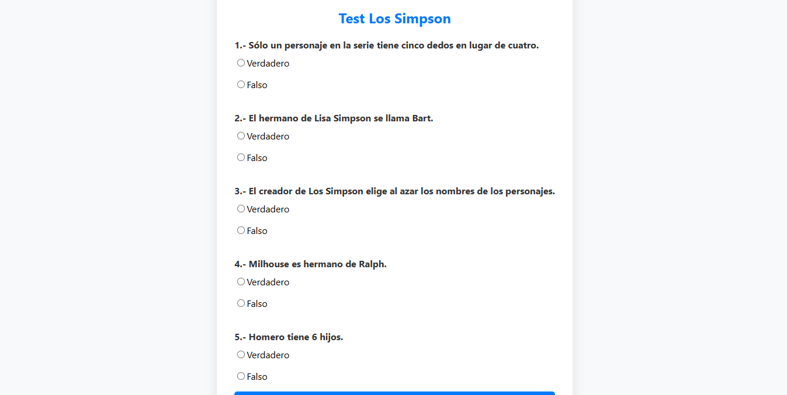

# Quiz Interactivo sobre Los Simpson

Esta actividad web consiste en un quiz interactivo sobre la popular serie animada "Los Simpson". Los usuarios responden a una serie de preguntas de opción múltiple y, tras enviar sus respuestas, reciben una evaluación de su conocimiento sobre la serie. La aplicación utiliza HTML y CSS para la interfaz de usuario, y PHP para el procesamiento y evaluación de las respuestas.

  

El script PHP procesa los datos ingresados en el formulario:

- **Obtención de Datos:** Recibe las respuestas ingresadas a través de $\_POST.

- **Evaluación de Respuestas:** Verifica las respuestas del usuario y asigna puntos según las respuestas correctas.

- **Determinación del Mensaje:** Basado en la cantidad de puntos obtenidos, asigna un mensaje de evaluación.

- **Generación de Salida:** Imprime el resultado total de puntos, el mensaje correspondiente y las respuestas correctas.

Esta actividad demuestra habilidades en el desarrollo de aplicaciones web interactivas utilizando tecnologías de front-end y back-end, ofreciendo una experiencia de usuario dinámica y educativa.

**Consulta la versión preliminar de la actividad aquí:** [https://ejercicio_04.com](https://www.alejandrovillegas.dev/projects/exercise-04/index.html)

# 📌 Información de la Actividad

Esta actividad ha sido desarrollado como parte del portafolio de soluciones tecnológicas, con el objetivo de ofrecer una herramienta eficiente y funcional para usuarios autodidactas interesados en la gestión y desarrollo de proyectos web.

- **Área**: Desarrollo de Actividades Web

- **Usuario Final**: TecNM

- **Fecha de Desarrollo**: 06 de abril de 2018

- **Portafolio de Proyectos**: [www.alejandrovillegas.dev](https://www.alejandrovillegas.dev)

## 🔧 Guía de Instalación y Configuración de la Actividad

1. Descargue y descomprima el archivo del proyecto en su sistema local.

La actividad ahora está funcionando en su entorno local. 🎉
